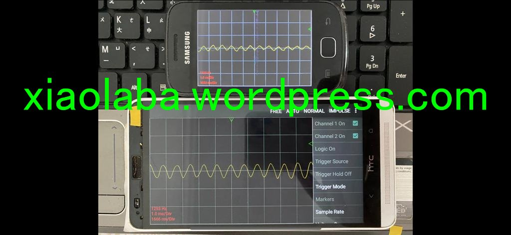

# Android_APK_backup  
apk backup from those old phones  

some app, the apk has exact image for different android version, but some are different.  

examples,  

  

https://play.google.com/store/apps/details?id=com.ses.app.apkexport&hl=zh_TW  

https://play.google.com/store/apps/details?id=com.nfx.noscpro&hl=zh_TW  

### apk dump 

2020-05-02, 14:40, 140,630 _ [APK_Export_3.2.4_HTC_8088_Android_5.0.2.apk](APK_Export_3.2.4_HTC_8088_Android_5.0.2.apk)    
2020-04-28, 14:45, 140,630 _ [APK_Export_3.2.4_samsung_GT-S5660_android_2.3.6.apk](APK_Export_3.2.4_samsung_GT-S5660_android_2.3.6.apk)    

2020-04-28, 14:46, 235,275 _ [Oscilloscope.6.1.24_HTC_8088_Android_5.0.2.apk](Oscilloscope.6.1.24_HTC_8088_Android_5.0.2.apk)  
2020-05-02, 13:59, 382,135 _ [Oscilloscope_5.0.3_samsung_GT-S5660_android_2.3.6.apk](Oscilloscope_5.0.3_samsung_GT-S5660_android_2.3.6.apk)    

### fc_apk.bat  
to compare apk or differences

### filelist.bat  
the output of result

